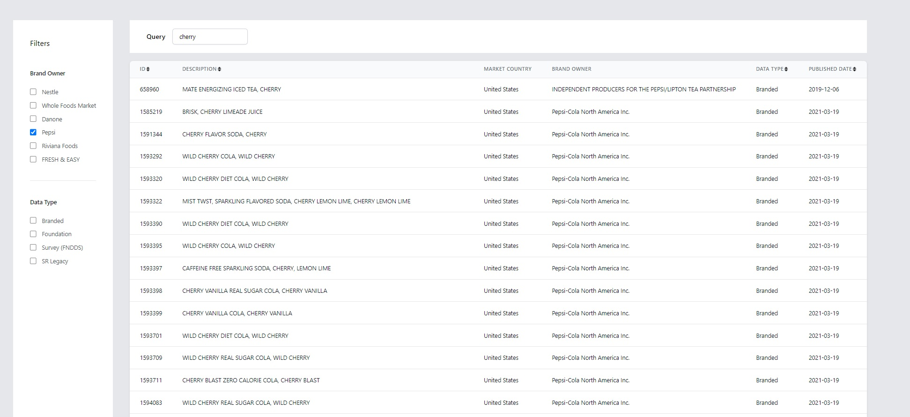

## Food Data Api search
This is mini app for browsing records from [Food Data Api](https://app.swaggerhub.com/apis/fdcnal/food-data_central_api/1.0.0#/FDC/postFoodsSearch).

## How to Install and Run the Project

- `npm install`

- `node ./server.js` (port 4000)

- `npm run start` (port 3000)

GraphQL playground - http://localhost:4000/graphql

Then go to http://localhost:3000 to play with the UI.

## How to Use the Project

Once its up and running, UI allow us to type the query to search particular food with additional filters and sort options.

Additional features:
- Filters
- Query Input
- Sorting

Example:

1. Type `cherry` in Query input
2. Select filter `Pepsi` in the Brand Owner section
3. That will display all of the Pepsi products related to cherry flavour

